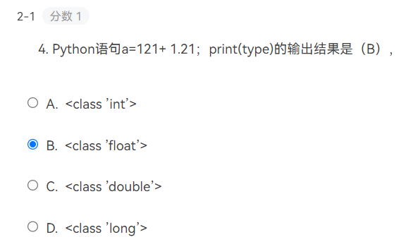
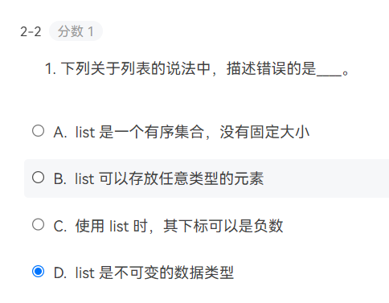
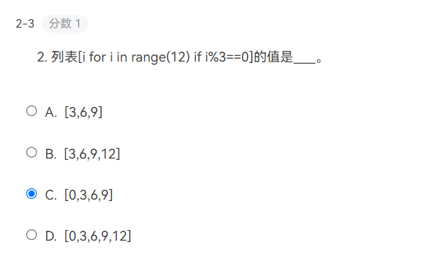
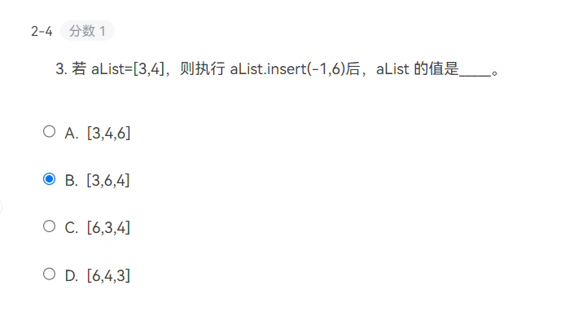
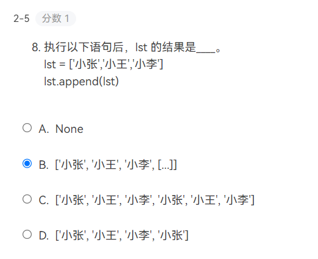

### 选择题












### 7-1 成绩等级统计

成绩等级分为A、B、C、D、E、F共6档，依次输入学生的学号，成绩等级。对各等级的人数进行统计并输出该等级的学号。输出格式为：
等级：人数
学号 学号

输入格式:

输入若干行的学号，成绩等级，以#结束。（输入的学号假设唯一）

输出格式:

输出所有等级的人数，并在每个等级的下方输出所有该等级的学号，每个学号后面都有2个空格。具体格式见样例


```python
A,B,C,D,E,F = [],[],[],[],[],[]
zong = []
while True:
    aa = input()
    if aa == '#':
        break
    t1,t2 = aa.split()
    if 'A' in aa:
        A.append(t1)
    if 'B' in aa:
        B.append(t1)
    if 'C' in aa:
        C.append(t1)
    if 'D' in aa:
        D.append(t1)
    if 'E' in aa:
        E.append(t1)
    if 'F' in aa:
        F.append(t1)
if len(A) == 0:
    print('等级A: %d人'%len(A))
else:
    print('等级A: %d人'%len(A))
    print("   分别是：  ",end='')
    for i in A:
        print(i,end='  ')
    print()
if len(B) == 0:
    print('等级B: %d人'%len(B))
else:
    print('等级B: %d人'%len(B))
    print("   分别是：  ",end='')
    for i in B:
        print(i,end='  ')
    print()
if len(C) == 0:
    print('等级C: %d人'%len(C))
else:
    print('等级C: %d人'%len(C))
    print("   分别是：  ",end='')
    for i in C:
        print(i,end='  ')
    print()
if len(D) == 0:
    print('等级D: %d人'%len(D))
else:
    print('等级D: %d人'%len(D))
    print("   分别是：  ",end='')
    for i in D:
        print(i,end='  ')
    print()
if len(E) == 0:
    print('等级E: %d人'%len(E))
else:
    print('等级E: %d人'%len(E))
    print("   分别是：  ",end='')
    for i in E:
        print(i,end='  ')
    print()
if len(F) == 0:
    print('等级F: %d人'%len(F))
else:
    print('等级F: %d人'%len(F))
    print("   分别是：  ",end='')
    for i in F:
        print(i,end='  ')
```


### 7-2 朗诵比赛得分计算

学校举办朗诵比赛,邀请了10位评委为每一名参赛选手打分。输入十个整数，作为某个选手获得的10位评委的打分。编写程序,根据以下规则计算该参赛选手的最终得分：
(1)去掉一个最高分；
(2)去掉一个最低分；
(3)最终得分为剩下8个分数的平均值。

输入格式:

在一行里输入10个整数，以逗号分隔。

输出格式:

输出一个实数，小数点后保留2位小数。

```python
a = list(map(float,input().split(',')))
a.remove(max(a))
a.remove(min(a))
print('%.2f'%(sum(a)/len(a)),end='')
```


### 7-3 根据学号输出信息

学号中包含了一个学生的相关信息，现有一学校的学号由8位数字组成，前两位表示学生入学年份，第3位和第4位表示学院代号，第5位表示某专业，第6位表示班级，最后两位表示在班级中的序号。该校共有11个学院，代号表示如下：

```
代号        学院名称
01      播音主持艺术学院
02      新闻与传播学院
03      电视艺术学院
04      动画与数字艺术学院
05      国际文化传播学院
06      华策电影学院
07      媒体工程学院
08      设计艺术学院
09      文化创意与管理学院
10      文学院
11      音乐学院
```

要求编程实现对学号进行分析，并输出相应信息。

输入格式:

输入学生姓名和学号，以空格隔开

输出格式:

输出学生的学院专业及班级信息

```
王雪梅 20071203
```

```python
dh = {"01":"播音主持艺术学院",
"02":"新闻与传播学院",
"03":"电视艺术学院",
"04":"动画与数字艺术学院",
"05":"国际文化传播学院",
"06":"华策电影学院",
"07":"媒体工程学院",
"08":"设计艺术学院",
"09":"文化创意与管理学院",
"10":"文学院",
"11":"音乐学院"}
name,sn = input().split()
print('%s是20%s级%s%s号专业%s班第%s号学生'%(name,sn[0:2],dh[sn[2:4]],sn[4:5],sn[5:6],sn[6:]),end='')
```


### 7-4 字典基本运算

请补充横线处的代码。dictScore 中存放了你的2021-2022-2学期选课学分，计算并输出学期学分总数。

输入格式:

dictScore = {'计算机组成原理':3,'离散数学':4,'企业见习':1,'Web':4,'计算机体系结构':2.5,'数理统计':3,'实训':2,'人文选修':1}。

输出格式:

输出学分总数。

```python
dictScore = {'计算机组成原理':3,'离散数学':4,'企业见习':1,'Web':4,'计算机体系结构':2.5,'数理统计':3,'实训':2,'人文选修':1}
n = 0
for i in dictScore.values():
    n += i
print(n)
```

